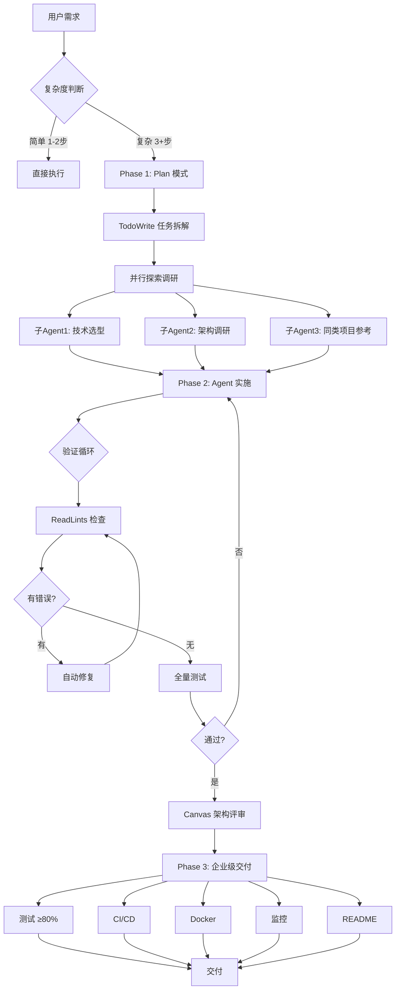

# AIcoding 工作流架构

## 全流程图



## 六个阶段

| Phase | 名称 | 干什么 | 产出 |
|:--:|------|--------|------|
| 0 | 会话初始化 | 读 AGENTS.md / MEMORY.md / 项目上下文 | 上下文就绪 |
| 1 | Plan | TodoWrite 拆任务 + 并行调研 | 任务列表 + 调研结论 |
| 2 | Agent 实施 | 按 todo 顺序写代码 | 可运行代码 |
| 3 | 验证循环 | ReadLints → 修复 → 测试 → Canvas 评审 | 零 lint 错误 + 测试通过 |
| 4 | 企业交付 | 补 CI/CD、Docker、监控、文档 | 生产级项目 |
| 5 | 复盘 | 更新 MEMORY.md 记录教训 | 下次更好 |

## 验证闭环

```
代码修改 → ReadLints → 有错? → 自动修 → 再查
                              ↓ 无错
                         全量测试 → 失败? → 回实施
                              ↓ 通过
                         Canvas 架构评审 → 交付
```

## 关键设计决策

| 决策点 | 选择 | 理由 |
|--------|------|------|
| 并行调研 | 3 个子 Agent 同时跑 | 技术选型/架构/参考项目互相独立 |
| 验证时机 | 每次编辑后立即 lint | 错误越早发现修复成本越低 |
| 交付标准 | 80% 测试覆盖 | 平衡质量与效率 |
| 用户交互 | Plan 模式最多 2 问 | 需求不清楚时问关键问题，其余自己定 |
