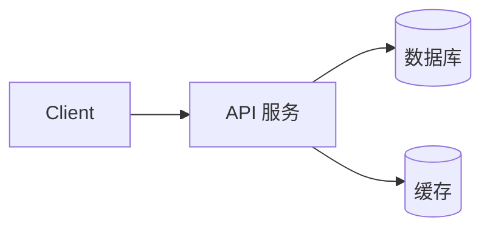

# 项目名

一句话说清楚这是什么。

## 特性

- 功能点 1
- 功能点 2
- 功能点 3

## 快速开始

```bash
git clone <repo>
cd <project>
docker compose up
# 打开 http://localhost:8000
```

## 架构



## 目录结构

```
src/
├── api/          # 路由
├── models/       # 数据模型
├── services/     # 业务逻辑
└── main.py       # 入口
```

## 环境变量

| 变量 | 说明 | 默认 |
|------|------|------|
| APP_ENV | 环境 | development |

## 测试

```bash
pytest --cov=. --cov-fail-under=80
```

## 部署

```bash
docker compose -f compose.yml -f compose.prod.yml up -d
```

## License

MIT
